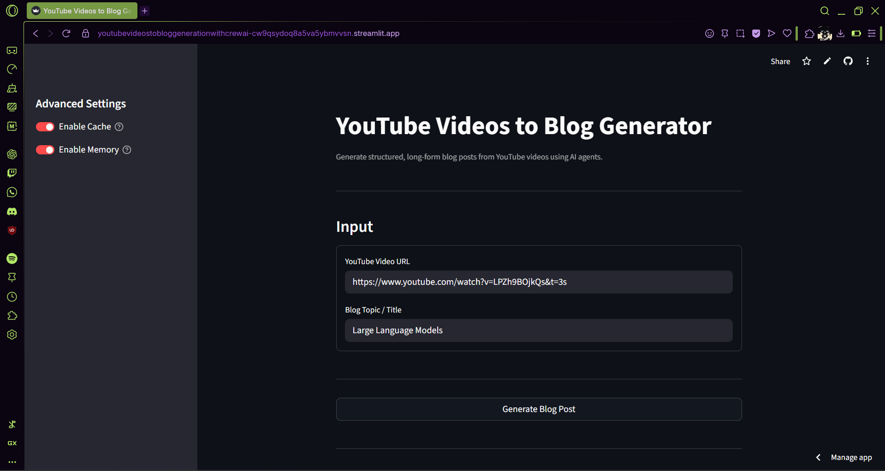
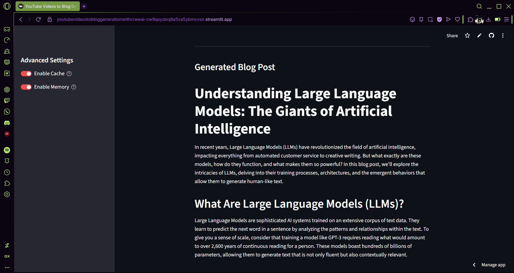
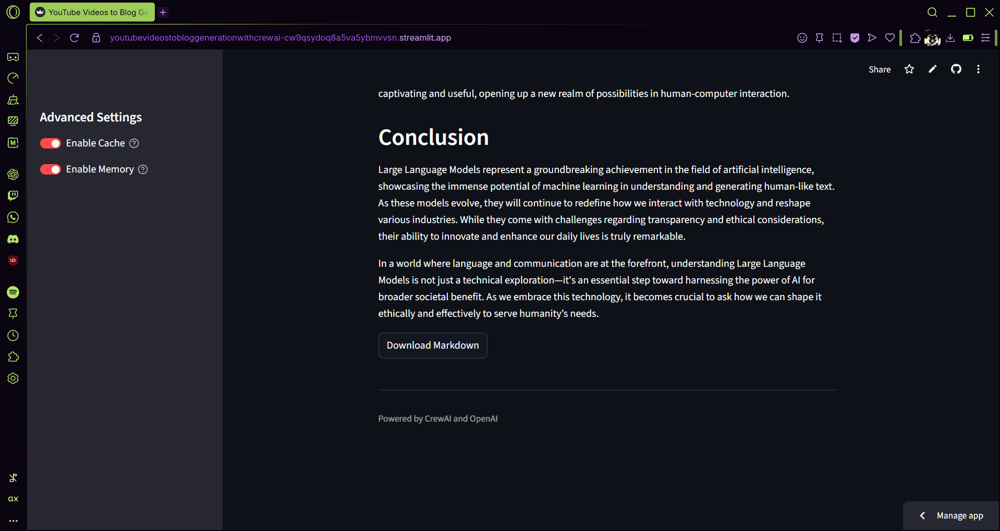
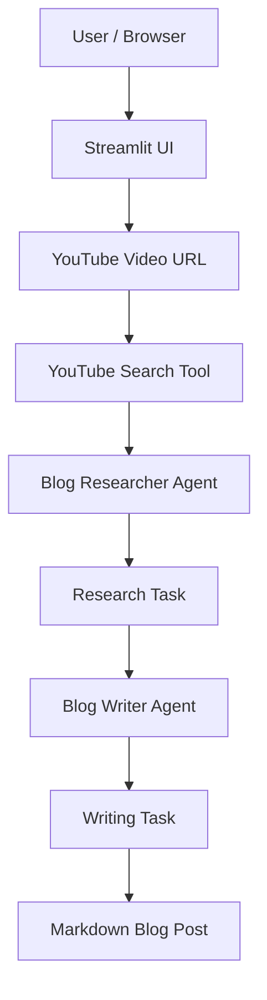

# Multi Agent CrewAI-Based YouTube Videos to Blog Generator

An **end-to-end, cloud-hosted multi-agent content generation system** that converts YouTube videos into structured, long-form blog posts with the help of external tools.
The application orchestrates specialized AI agents using **CrewAI** to research video content, extract key insights, and transform them into engaging written articles.

Built using **CrewAI**, **OpenAI**, **Streamlit Cloud**, and **YouTube tooling**, it demonstrates agent-based task decomposition and sequential reasoning in a practical content creation pipeline.

---

## Features
- Convert YouTube videos into long-form blog posts
- Multi-agent collaboration (researcher + writer)
- Automatic video transcription analysis
- Structured Markdown blog output
- Downloadable blog posts
- Optional agent memory and caching
- Simple Streamlit-based UI

---

## Demo

### Input

### Blog Generation

### Output Download

---

## Architecture

## License

MIT License
